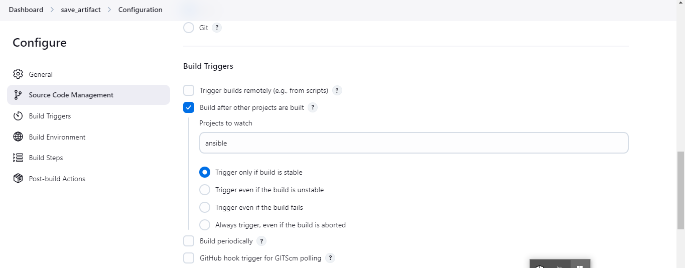
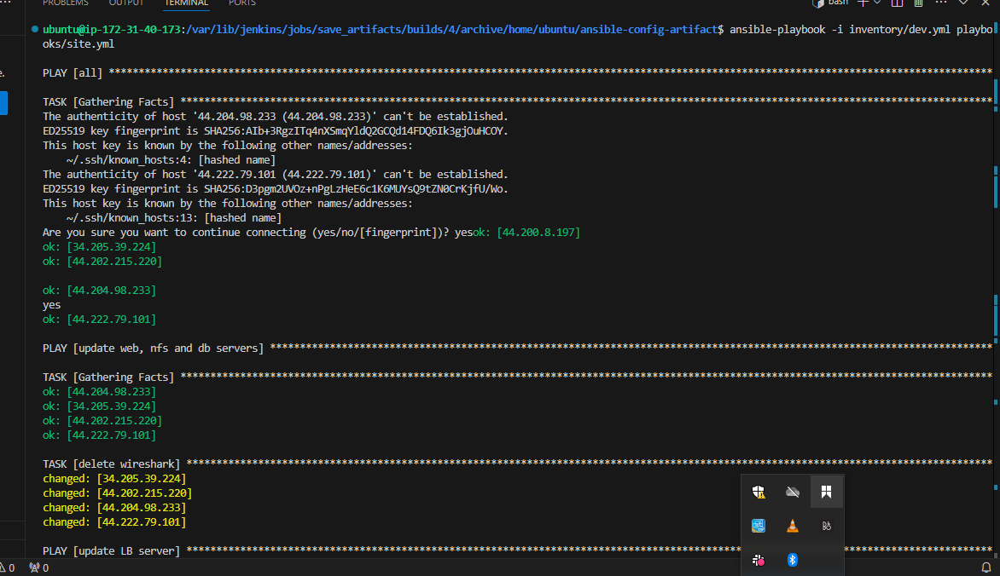

# Ansible-Refactoring-Assignments-and-Imports

# Ansible-Refactoring-Assignments-and-Imports

Refactoring is the process of restructuring existing computer code without changing its external behavior. It improves the internal structure of the code, making it cleaner, more maintainable, and often more efficient. 
Why Refactor?
Improve Code Readability: Makes code easier to understand.
Enhance Maintainability: Easier to modify or extend.
Reduce Complexity: Removes unnecessary complexity and redundancy.
Optimize Performance: Sometimes refactoring can lead to more efficient code.
Fix Hidden Bugs: Restructuring code often exposes subtle bugs.
When to Refactor?
Before adding new features: Ensures that the base code is solid.
After finding bugs: Can improve the code and make future bugs less likely.
During code reviews: Refactoring can be a recommendation from a peer review.
When code smells appear: Address bad practices like duplicated code, large classes, long methods, etc.

### 1 Jenkins Job Enhancement
This project is a continuation of the initial project (Ansible Automationn Project). So, I will continue working on ansible-config-mgt repository and make some improvements on my code
Here, I will refacotr ansible code by importing other playbooks into a new playbook, site.yml.

On Jenkins-Ansible server, create a new directory, ansible-config-artifact and change its permission to grant jenkins access to the directory

```
sudo mkdir /home/ubuntu/ansible-config-artifact  
chmod -R 0777 /home/ubuntu/ansible-config-artifact
```


First, do jenkins job enhancement by creating a new freestyle project on Jenkins named "save_artifacts".


Download copy artifact pluging to aid save_artifact


Configuration

It would keep only 2 arfitacts per time


Save_artifact will get job automatically from ansible free style project not from Github repository



then save artifacts into /home/ubuntu/ansible-config-artifact directory


To store Artifacts, also configure the post build step.

The main idea of save_artifacts project is to save artifacts into /home/ubuntu/ansible-config-artifact directory. To achieve this, create a "Build step" that choose "copy artifacts from other project" e.g ansible (freestyle project as source project) and /home/ubuntu/ansible-config-artifact directory as target directory

Click on the ansible job drop-down icon and click on Build Now to test if the ansible job will successfully trigger the save-artifacts job.


You will notice the save-artifacts job has an upstream project called ansible which means they are connected to each other


Verify if the artifacts of the ansible are present in your ansible-config-artifacts directory on your Jenkins-Ansible server by running the following command: 

```
cd /home/ubuntu/ansible-config-artifact && ll 
```

if its not avaialable here, check

```
cd /var/lib/jenkins/jobs/ansible/builds/<build number>/archive or this cd /var/lib/jenkins/jobs/save_artifacts/builds/<build number>/archive/home/ubuntu/ansible-config-artifact
```


The /var directory in Jenkins is neither a root nor a home folder, but a subdirectory of the Jenkins installation directory. It contains various files and folders that are used by Jenkins, such as logs, plugins, jobs, etc. The /var directory has a parent folder, which is the Jenkins installation directory, which can vary depending on how Jenkins was installed and configured. If Jenkins was installed using the Debian package, the installation directory would be /usr/share/jenkins, and the /var directory would be /usr/share/jenkins/var. If Jenkins was installed using the WAR file, the installation directory would be the location of the WAR file, and the /var directory would be a subdirectory of that location.

### STEP 2: Refactoring Ansible Code by Importing Into Site.yml
Create a new branch called Refactor
Creating a new branch in version control systems like Git is a powerful concept that allows developers to work on different features, bug fixes, or experiments in isolation from the main codebase

unlike in Project 11 where all tasks were written in a single playbook conmmon.yml, pretty simple set of instructions for only 2 types of OS, but imagine you have many more tasks and you need to apply this playbook to other servers with different requirements.Breaking tasks up into different files is an excellent way to organize complex sets of tasks and reuse them

Within playbooks folder, create a new file and name it site.yml. This file will now be considered as an entry point into the entire infrastructure configuration.Other playbooks will be included here as a reference.In other words, site.yml will become a parent to all other playbooks that will be developed, Including common.yml created initial project. 

For easy organization, Create a new folder in root of the repository and name it static-assignments. The static-assignments folder is where all other children playbooks will be stored.
Move common.yml into static-assignments folder
Inside site.yml, import common.yml 


Since the wireshark has been installed on the webservers, it will be wise to create another playbook, common-del.yml to delete wireshark instead of using common.yml to uninstall wireshark


In common-del.yml, write a yml code to delete wireshark

```
---
- name: update web, nfs and db servers
  hosts: webservers, nfs, db
  remote_user: ec2-user
  become: yes
  become_user: root
  tasks:
  - name: delete wireshark
    yum:
      name: wireshark
      state: removed

- name: update LB server
  hosts: lb
  remote_user: ubuntu
  become: yes
  become_user: root
  tasks:
  - name: delete wireshark
    apt:
      name: wireshark-qt
      state: absent
      autoremove: yes
      purge: yes
      autoclean: yes

```


update site.yml with the code

```
---
- hosts: all
- import_playbook: ../static-assignments/common-del.yml
```


Merge the changes from the refactor branch into the main branch and run the playbook

Before running an ansible playbook

Ensure you connect to Jenkins-ansible server via OpenSSH
Open terminal
Ensure pem key is in the directory available in the remote config file
Run this command eval ssh-agent -s && ssh-add new.pem && ssh-add -l
```
cd /home/ubuntu/ansible-config-mgt/
```

```
/var/lib/jenkins/jobs/ansible/builds/<build number>/arch
```


Run site.yml against dev.yml folders
```
ansible-playbook -i inventory/dev.yml playbooks/site.yaml
```





confirm wireshark has been uninstalled in the servers


### Step3 : Configuring UAT WebServers as RoleServers for User Acceptance Testing
To avaoid making the work messy, it will be wise to use a dedicated role to make uat server configuration reusable instead of using same playbook
To demonstrate the role functions, launch two new RHEL servers used as UAT

To create a role, you must create a directory called roles in the ansible-config-mgt directory. 

Two ways to achieve this folder structure:

1 Using an Ansible utility called ansible-galaxy inside ansible-config-mgt/roles directory (Note that you need to create a roles directory upfront).

```
mkdir roles
cd roles
ansible-galaxy init webserver
```


2 Create the directory/file structure manually.
Since all my codes are saved in Github, I will explore the second option. In this case, I wouldnt have to use the Ansible-Galaxy utility on the Jenkins Server

To create the folder structure below, run the command:

```
cd .. && mkdir roles && cd roles && mkdir webserver
cd webserver && touch README.md && mkdir defaults handlers meta tasks templates
cp main.yml meta && mv main.yml tasks
cd .. ** tree webserver
```


Ansible Roles Path Configuration
Ansible roles are a way of organizing your Ansible tasks into reusable and modular units. They allow you to define a common structure and behavior for a specific purpose, such as configuring a service or installing a package. Ansible roles can also help you manage the complexity and dependencies of your Ansible playbooks.

Ansible roles have a predefined directory structure that contains several YAML files and other resources. Each directory serves a different function and can contain one or more files. The main directories in an Ansible role are:

defaults: This directory contains the default values for the variables used in the role. These values can be overridden by other variables or parameters. The main file in this directory is defaults/main.yml.

vars: This directory contains the variables that are specific to the role. These values have a higher precedence than the default values and can be used to customize the role behavior. The main file in this directory is vars/main.yml.

tasks: This directory contains the main list of tasks that the role executes. These tasks are the core logic of the role and can use variables, modules, handlers, templates, and other resources. The main file in this directory is tasks/main.yml.

files: This directory contains the static files that the role copies or transfers to the remote hosts. These files can be used by the tasks or templates in the role. The files in this directory do not have any extension or format.

templates: This directory contains the Jinja2 templates that the role uses to generate dynamic files on the remote hosts. These templates can use variables, filters, expressions, and other features of the Jinja2 language. The files in this directory have the .j2 extension.

handlers: This directory contains the handlers that the role notifies when a task changes the state of a resource. These handlers are used to perform actions such as restarting a service or reloading a configuration. The main file in this directory is handlers/main.yml.

meta: This directory contains the metadata that describes the role. This metadata can include information such as the role name, author, license, dependencies, platforms, and other details. The main file in this directory is meta/main.yml.

tests: This directory contains the tests that verify the functionality of the role. These tests can use the Ansible modules, inventory, and playbooks to run the role against different scenarios and environments. The main files in this directory are tests/inventory and tests/test.yml.
By default, Ansible looks for roles in the following locations:

In collections, if you are using them.

In a directory called roles/, relative to the playbook file.
In the configured roles_path. The default search path is 
 ~/.ansible/roles:/usr/share/ansible/roles:/etc/ansible/roles.
In the directory where the playbook file is located.


Update the inventory/uat file and configure the tasks/main.yml file
Update the ansible-config-mgt/inventory/uat file with the private IP adresses of the two UAT Web Servers.
Also include path to the key.pem file in the format
[uat-webservers:vars]
ansible_ssh_private_key_file=/home/ubuntu/new.pem

```
[uat-webservers]
<Web1-UAT-Server-Private-IP-Address> ansible_ssh_user='ec2-user'
<Web2-UAT-Server-Private-IP-Address> ansible_ssh_user='ec2-user'

[uat-webservers:vars]
ansible_ssh_private_key_file=/home/ubuntu/new.pem
```


In the tasks directory, configure the main.yml file to have the following configurations:

Install and Configure Apache (httpd service)

Clone Tooling Website form GitHub https://github.com/<your-name>/tooling.git

Ensure the tolling website code is deployed to /var/www/html on the 2 UAT Web Servers

Make sure httpd service is started
The main.yml will consist of the following tasks:

```
---
- name: install apache
  become: true
  ansible.builtin.yum:
    name: "httpd"
    state: present

- name: install git
  become: true
  ansible.builtin.yum:
    name: "git"
    state: present

- name: clone a repo
  become: true
  ansible.builtin.git:
    repo: https://github.com/<your-name>/tooling.git
    dest: /var/www/html
    force: yes

- name: copy html content to one level up
  become: true
  command: cp -r /var/www/html/html/ /var/www/

- name: Start service httpd, if not started
  become: true
  ansible.builtin.service:
    name: httpd
    state: started

- name: recursively remove /var/www/html/html/ directory
  become: true
  ansible.builtin.file:
    path: /var/www/html/html
    state: absent

```


At this stage, push code to github repository and remember to merge branch, the refactor and the main branch.

this will trigger a Jenkins build job in  ansible and then save_artifact.


On the Jenkins-Ansible server, do 
cd /home/ubuntu/ansible-config-mgt

```
(/var/lib/jenkins/jobs/save_artifacts/builds/build number/archive/home/ubuntu/ansible-config-artifact)

```

and run the playbook.

```
ansible-playbook -i inventory/uat.yml playbooks/site.yaml
```


on your web brouser, check
```
http://public_IP_address_of_UAT_1_Web_Server/index.php
```


Ansible architecture now looks like this:


